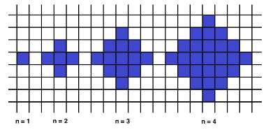

Link para meu perfil no codeSignal: https://app.codesignal.com/profile/jefferson_v
 
A solução para os desafios descritos aqui estarão na pasta de sua respectiva linguagem com o nome do desafio. Todo desafio será resolvido em Javascript, Python e PHP.
 
  

#desafio 1 
Given an array of integers, find the pair of adjacent elements that has the largest product and return that product. 

#desafio 2 
Below we will define an n-interesting polygon. Your task is to find the area of a polygon for a given n.
A 1-interesting polygon is just a square with a side of length 1. An n-interesting polygon is obtained by taking the n - 1-interesting polygon and appending 1-interesting polygons to its rim, side by side. You can see the 1-, 2-, 3- and 4-interesting polygons in the picture below. 

 

#desafio 3 
Ratiorg got statues of different sizes as a present from CodeMaster for his birthday, each statue having an non-negative integer size. Since he likes to make things perfect, he wants to arrange them from smallest to largest so that each statue will be bigger than the previous one exactly by 1. He may need some additional statues to be able to accomplish that. Help him figure out the minimum number of additional statues needed. 
